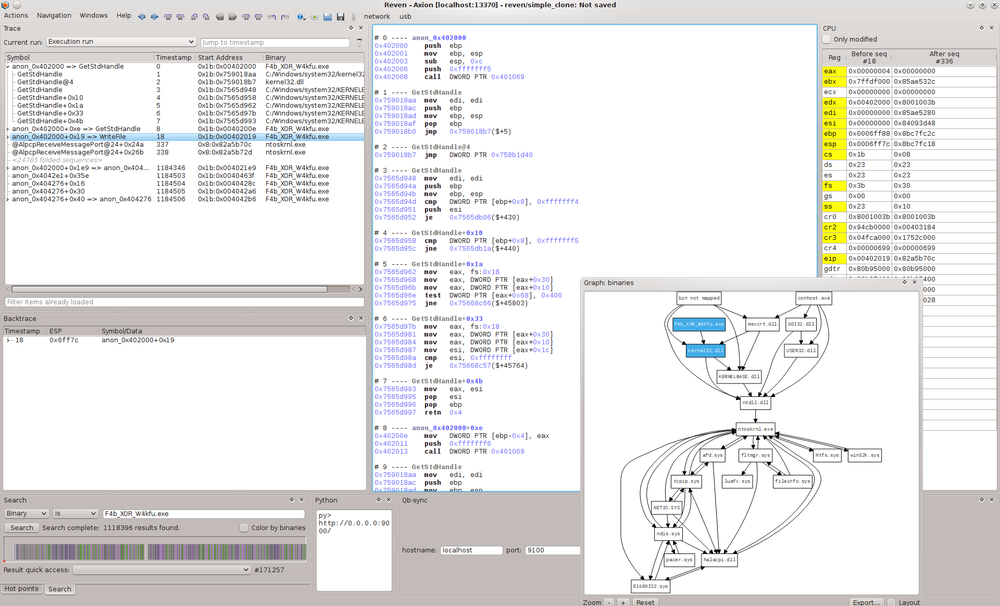
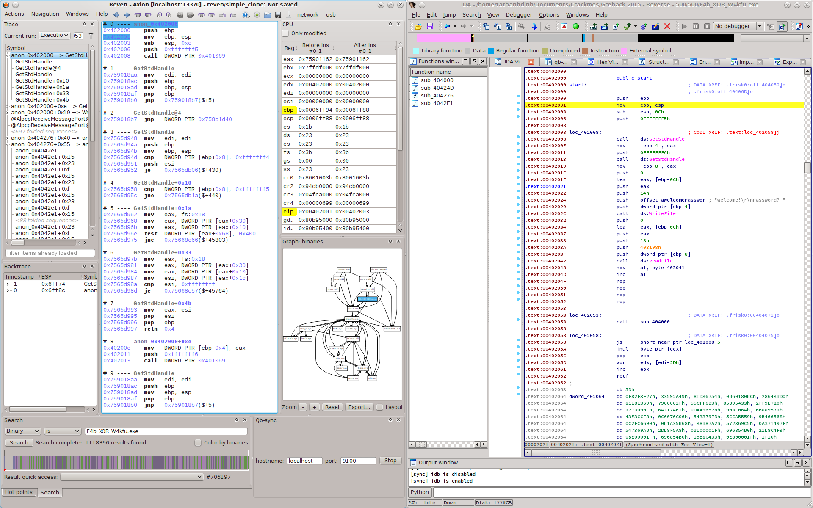
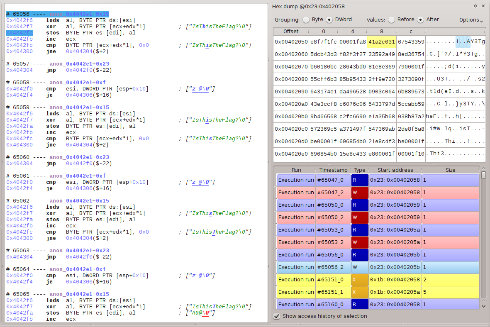
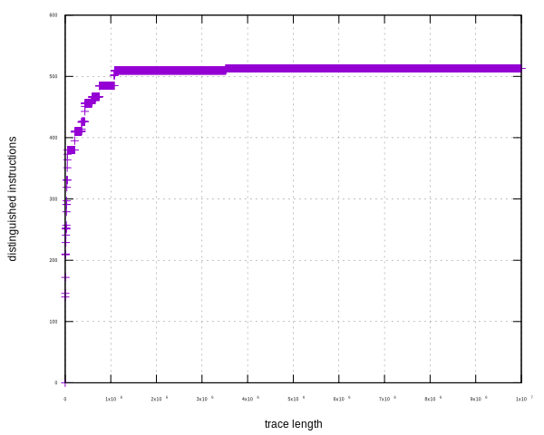
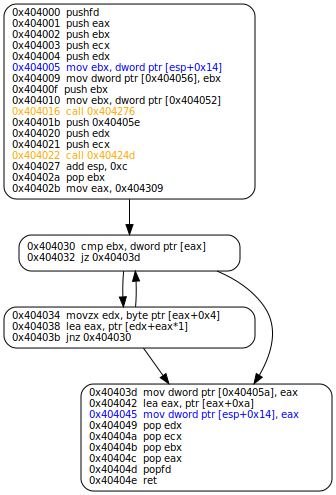
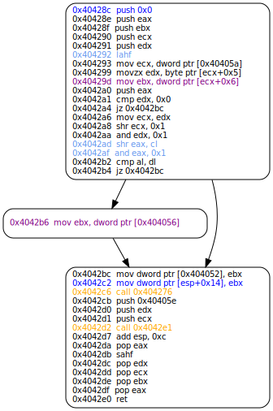

# Deobfuscating an _onion_ obfuscated challenge with REVEN

  We present a code reverse engineering task with our product Reven. The binary examined here is `F4b_XOR_W4kfu`, it is also the challenge of the highest point over all categories (cryptography, exploit, reverse engineering, etc) in the [Grehack 2015's CTF](https://grehack.fr/2015/ctf). The binary is heavily obfuscated, but the obfuscation techniques implemented are novel and interesting.

  This is the first article of a series where we introduce our ongoing work in developing an *automated code deobfuscation* system using the *symbolic execution* framework of REVEN. Since our approach is **operational** (i.e. we require some information about how the obfuscation techniques are implemented) this article presents technical details that we discovered in reversing `F4b_XOR_W4kfu`.

  **Remark:**
  *To the our best knowledge, most approaches in binary code deobfuscation are operational, fully denotational approaches work in very strict cases only. As a direct consequence of [Rice's theorem](https://en.wikipedia.org/wiki/Rice%27stheorem), learning general programs simply from input/output relation is a well-known undecidable problem. Even for much more restricted contexts, static analysis is [proven to be NP-hard](http://citeseerx.ist.psu.edu/viewdoc/summary?doi=10.1.1.35.2337) for [smartly](https://www.cs.ucsb.edu/~chris/research/doc/acsac07limits.pdf) [obfuscated](http://llvm.org/pubs/2008-02-ImpedingMalwareAnalysis.pdf) programs. Recent [semantics-based](https://www.cs.arizona.edu/people/debray/Publications/ccs-unvirtualize.pdf) approaches are intrinsically [operational](http://static.usenix.org/event/woot09/tech/full_papers/rolles.pdf); though [some](https://cs.arizona.edu/~debray/Publications/ccs2015-symbolic.pdf) are considered [generic](https://www.cs.arizona.edu/people/debray/Publications/generic-deobf.pdf), they work only on simple cases of very specific obfuscation techniques. However, special classes of loop-free programs can be efficiently [synthesized](http://people.eecs.berkeley.edu/~sseshia/pubdir/synth-icse10.pdf) from input/output with helps of SMT solvers.*

## Reven - a very short introduction

  Basically, REVEN Axion is a **system-level symbolic execution** engine,  enriched by code analysis plugins interacting with the core using Python or C/C++ API. One of the essential differences between Reven and other engines is that it does symbolic execution for *all execution threads* presenting on the system, from ring 0 to ring 3.

  In a basic reversing engineering task with Reven, we start by creating a **scenario** which executes the considered binary in a virtual machine; the result of the scenario will be used in further analysis. For example, in case of `F4b_XOR_W4kfu` we create a scenario which executes the binary with some input flag, the scenario terminates when the binary stops.

  

  An advantage of Reven is that it **computes** all instructions being executed (instead of running them on real hardware), it is then virtually immune from anti-debugging/anti-instrumenting tricks that might be applied. Symbolically executed instructions come from all executing threads on the system since a *scenario is system-wide*; but we can always filter instructions executed by the examined binary, the result is somehow equivalent with the execution trace.

  **Remark:**
  *The symbolic execution approach of Reven is different from approaches of debuggers and [dynamic](http://www.dynamorio.org/) [binary](https://software.intel.com/en-us/articles/pin-a-dynamic-binary-instrumentation-tool) [instrumentation](http://valgrind.org/) [tools](http://www.frida.re/) where instructions are still executed on the real hardware, that is still a rich source for [escaping tricks](https://recon.cx/2012/schedule/attachments/42FalconRiva2012.pdf) which exploit [nontransparent effects](https://www.blackhat.com/docs/us-14/materials/us-14-Li-Defeating-The-Transparency-Feature-Of-DBI.pdf) of DBI. Yet, Reven has to pay for this "more transparent" approach, it is slower than DBI tools and debuggers.*

  **Synchronization with IDA Pro:** Reven is rather a dynamic analysis tool, it has not yet advanced static analysis features (static disassembly/decompilation, control-flow analysis, etc) that we may normally observe in [other](https://www.hopperapp.com/) [tools](https://www.hex-rays.com/products/ida/). Currently, we can **synchronize** between Reven and IDA Pro (as a "de-facto" reverse code engineering tool) using [qb-sync](https://github.com/quarkslab/qb-sync) to combine the strength of both.

  That is enough for self-promoting words :), it's time to take our hand dirty.

## Introduction

  `F4b_XOR_W4kfu.exe` is a 32 bits PE binary, without any fancy GUI, it asks for a password from the standard input and then prints `Nop!` or `Yes!`. The mission is to find out the good password (one that makes the program print `Yes!`).

    ./F4b_XOR_W4kfu.exe
    Welcome!
    Password? 1234aqzert
    Nop!⏎

  The program uses several **obfuscation** techniques to prevent itself from being analyzed. *First*, its execution traces are extremely long taking consideration that the program is *just* a CTF challenge; to get some idea about how long are these trace, after receiving the input, there are 2.716.465.511 instructions executed until the first comparison of the password checking procedure. This is because of a [code decryption/re-encryption](https://www.cosic.esat.kuleuven.be/wissec2006/papers/3.pdf) mechanism and of a [nested multiprocess virtual machine](https://aspire-fp7.eu/spro/wp-content/uploads/SPRO2015_Workshop_Talk_V2.pdf) execution model.

  *Second*, the "input related" instructions in a trace are not local, they instead spread out the long trace, that makes difficult to figure out how the input password is manipulated and checked; moreover the password checking algorithm is "mostly" constant time.

  *Last but not least*, most instructions of the binary are encrypted, they are decrypted just before executing and are immediately re-encrypted later, so we cannot [unpack](https://www.cs.arizona.edu/people/debray/Publications/static-unpacking.pdf) it in the [classical sense](http://ftp.cs.wisc.edu/paradyn/papers/Roundy12Packers.pdf). Some authors classify such technique of code packing into [type VI](http://s3.eurecom.fr/docs/oakland15_packing.pdf), the most sophisticated class of binary code packers.

  These properties make difficult for direct dynamic/concolic/static analysis. Low-hanging fruit approaches, e.g. black-box attack on counting number of executed instructions, seems not feasible: there is volume of more than 2.7 billion instructions must be passed before reaching the first "input sensitive" comparison

## Workaround

  The binary has 4 sections, all are marked as executable, writable and executable (how evil it is :-)). The section `.frisk0` is simply an ID of all GreHack's binaries, so we are not surprise. The binary starts from `0x402000` which is also the entry point, no TLS callback trick is applied, as confirmed by both Reven and IDA.

  Several first instructions are not interesting, for example, ones at `0x402008` and `0x402013` are calls to `GetStdHandle`, there is also a call `WriteFile` at `0x40202c`, and a call `ReadFile` at `0x402042`. They simply print the strings `Welcome!` and `Password?`, then reads password from the standard input.

  

  But this short easy reversing time has finished, from now, easy codes do not exist anymore >:)

### Code overwriting

  Passing statically over simple instructions above, the next instructions seem "benign" :-), some `nop`(s), then a `call 0x40400`. However, Reven notices that there are lots of **execution after write** (i.e. some memory addresses are overwritten before getting executed). Some of them are redundant alerts since the process mapping mechanism of `ntoskrnl.exe`, but the first one which really attracts our attention is at `0x402058`: the really executed instruction is `xor eax, eax`, instead of `js 0x40200d` from the static disassembling result.

  

  **Remark:**
  *Different form DBI tools and debuggers which work at process level, Reven works at system level, it can trace the [flow of creating a process](https://download.microsoft.com/download/1/4/0/14045A9E-C978-47D1-954B-92B9FD877995/97807356648739_SampleChapters.pdf) (i.e. before the program gets run), here many instructions of the binary are mapped (i.e. written) into the memory using some functions (e.g. `MiCopyOnWrite`) inside `ntoskrnl.exe`, then executed when the program gets run. Consequently, these instructions are redundantly marked as "execution after write".*

  There must be something following `call 0x40400` has modified the instruction at `0x402058`. By backward [dynamic tainting analysis](http://bitblaze.cs.berkeley.edu/papers/taintcheck-full.pdf), Reven shows a chain of `read/write/execute` on this address, the nearest instruction which writes on the address is at `0x4042fa`, that is `stosb`.

  

### Code virtualization

  We now know that the binary will modify some instructions before executing them, this can be revealed by examining the instructions following `call 0x40400`. 

#### Control flow graph

  To get an intuition about what is going on, we extract a partial *control flow graph* from the trace of Reven; the following graph is constructed from a trace of 10.000.000 instructions starting from `0x402048`.

  
  (this is a high-resolution image, click on it to observe the details)

  **Remark:**
  *The control flow graph given by Reven is partial since it is constructed using the dynamic trace computed from running program with a concrete input, but it gives at least some information about which kind of code that we deal with.*

  The form of control flow graph suggests that it may be a kind of **virtual machine** with [switch-based dispatcher](http://static.usenix.org/event/woot09/tech/full_papers/rolles.pdf). The typical form of such a VM consists of a *dispatcher* located in several basic blocks, but there would exist many "non trivial" basic blocks to which control flow is transferred from a much smaller number of "dispatch points".

  These non trivial basic blocks representing opcodes are possibly, for example, ones start with the instruction at `0x402513`, `0x40206a`, `0x4025d`, etc; the control flow transferred to all of them comes from the basic block ends with `0x4042e0`, which may be supposed that this is the *dispatch point* of the dispatcher.

  Moreover, these basic blocks transfer control flow to the same basic block start with the address `0x404000` (since they both end with `call 0x404000`), which may be supposed that this is the *entry point* of the dispatcher.

  There are also basic blocks, for example, ones start with `0x4043a4`, `0x404371`, `0x40428c`, etc; they might not represent opcodes since their semantics is trivial, just a simple unconditional`jmp 0x40428`.

#### Distinguished instruction rate

  Another indication which suggests that this might be a VM, is the number of distinguished instructions over the total number of executed instructions. Since the number of "virtual instructions" is normally much smaller than the number of the real hardware instructions (i.e.`x86` ISA), we would normally observe that there are not "too much" distinguished instructions in a binary obfuscated by a VM. The following diagram presents the number of distinguished instructions over the trace length: there are only about 500 distinguished instructions over a trace of length 10.000.000!!!

  

  **Remark:**
  *Such a form of control flow graph can be observed also in binaries obfuscated by [VMProtect](http://vmpsoft.com/) and some initial versions of [Code Virtualizer](http://oreans.com/codevirtualizer.php). In recent versions, Code Virtualizer uses [threaded code](http://home.claranet.nl/users/mhx/ForthBell.pdf): the control flow to the next opcode's basic block will be calculated at the end of the current opcode's basic block, then we cannot observe this form. In some ad-hoc VM obfuscated binaries, e.g. [HyperUnpackMe2](http://crackmes.de/users/thehyper/hyperunpackme2/), the dispatcher has even multiple dispatch points (there was a very nice [writeup](http://www.openrce.org/articles/full_view/28) of this binary using IDA).*
  
  It might be worth noting that the patterns discussed above *just give a hint* to recognize the applied obfuscation technique. Without a serious analysis, we cannot confirm the binary is obfuscated by a VM. Indeed, the same patterns can be observed in programs which are not obfuscated at all; inversely, some program are VM obfuscated but these pattern are not [directly visible](http://www.lancaster.ac.uk/staff/wangz3/publications/trustcom.pdf). Finally, we do not give a formal definition (i.e. a mathematical model on which we can prove something is correct or not) for virtualization obfuscation yet :-). We will come back to this problem in another article.

## Reversing the first virtual machine

  Our intuition is now that there is VM whose entry point starts with `0x404000`, and single dispatch point ends at `0x4042e0`. To understand in details how it works, we now careful examine its dispatcher, whose the entry point is at `0x404000`.

### First phase

  The dispatcher can be divided into "two phases", between them are "transition instructions". The first phase comes with the following control flow graph.

  

#### Return address table

  As can be seen previously in the "global" CFG, the `ret` instruction at `0x40404e` will transfer the control flow to different basic blocks, but the continued instructions are not the ones following `call 0x404000`. The called function is then not a "standard" function which we normally observe in an Algol-like language: it does not return to the location following where it is called, the returned address must be [modified](https://en.wikipedia.org/wiki/Return-oriented_programming) somewhere.

  **Return address modification:** Looking into instructions at `0x404005` and `0x404009`, we observe that the original return address is saved to the memory at `0x404056`, then the return address is overwritten by the instruction `mov [esp + 0x14], eax` at `0x404045`. This new address is computed from a loop between `0x404030` and `0x40403b`.

  The semantics of the loop is simple: it consumes `ebx` which is the current return address (c.f. `pop` at `0x40402a` as well as `push` at `0x40400f`), and a list at address `0x404309`. It  looks for an entry in the list so that its `return address` is equal to the current return address. When the entry is found, the new return address is updated by the `transition code` of the entry. The structure of this list is shown below.

  

  Entries in this list are consecutive: *the location of the next entry is calculated by adding the current entry with its length*. So once we know the starting address, which is `0x404309`, all entries can be completely located. The following function calculates the new return address from the current one.

    // retTable is the array of byte(s) from 0x404309
    let calculateNewReturnAddress (retAddr:uint32) (retTable:byte[]) =
      let mutable entryOffset = 0
      while retAddr <> System.BitConverter.ToUInt32(retTable, entryOffset) do
        let entryLength = retTable.[entryOffset + 4]
        entryOffset <- entryOffset + (int entryLength)
      uint32 (entryOffset + 10)

#### Address interval computation and encryption

  We now notice to call instructions at `0x404016` and `0x404022`, the called functions are "standard", i.e. they return back to where they are called. These functions are strongly correlated, their semantics is simple but important.

  **Address interval:** the first one consumes a `dword` at `0x404052` (through `ebx`), a table of `dword`(s) at `0x40406d`; and return the first pair of two consecutive `dword`(s) of this table (through `ecx` and `edx`) satisfying `ecx <= ebx <= edx`. The following piece of code shows the algorithm.

    // inTable is the array of dword(s) from 0x404052 to 0x40424d
    let calculateGadgetInterval inEbx inTable =
      let loBounds, hiBounds = List.foldBack (fun addr (los, his) -> addr :: his, los) inTable ([], [])
      List.find (fun (lo, hi) -> (lo <= inEbx && inEbx <= hi)) <| List.zip loBounds hiBounds

  **Interval encryption:** the second consumes the output of the first one as an interval of addresses and the string `IsThisTheFlag?` (no, we have tried, and it is not the flag :-/), it simply `xor` this interval with this string using [ECB mode](https://en.wikipedia.org/wiki/Block_cipher_mode_of_operation).

#### Summary

So in the first phase, which starts by `pushfd` at `0x40400` and terminates by `ret` at `0x40404e`:

* the original return address is backed up in the memory at `0x404056`,
* an interval of addresses is calculated from a `dword` stored in the memory `0x404052`, then
* the interval is `xor`ed with the string `IsThisTheFlag?`.
* a new return address is calculated from the original one and a table of consecutive entries, 
* the address of the entry containing the new address is backed up in the memory at `0x40405a`

### Transition code

  Since the effect of the return address modification, the control flow is transferred to the transition instructions located at the new return address. We have introduced above the structure of the list of entries used to calculate the new return addresses. The new return addresses, i.e. locations of transition code, can be extracted easily now.

    0x404313; 0x404322; 0x404331; 0x404344; 0x404353; 0x404362; 0x404371; 0x404380; 0x40438f; 0x4043a4; 
    0x4043b3; 0x4043c2; 0x4043d1; 0x4043e3; 0x4043f2; 0x404401; 0x404410; 0x40441f; 0x40442e; 0x40443d; 
    0x40444f; 0x40445e; 0x40446d; 0x40447c; 0x40448b; 0x40449a; 0x4044a9; 0x4044b8; 0x4044c7; 0x4044d6; 
    0x4044eb; 0x4044fa; 0x404509; 0x404518; 0x404527; 0x404536; 0x404545; 0x404554; 0x404563; 0x404579; 
    0x404588; 0x404597; 0x4045a6; 0x4045b5; 0x4045c4; 0x4045d6; 0x4045e5; 0x4045f4; 0x404603; 0x404612; 
    0x404621; 0x404630; 0x40463f; 0x40464e; 0x40465d; 0x40466c; 0x40467b; 0x40468a; 0x404699; 0x4046a8

  We can also check these addresses on the "global" control flow graph, all of them terminates with the instruction `jmp 0x40428c` which transfers the control flow to the second phase of the dispatcher.

### Second phase

  The second phase of the dispatcher starts from the address `0x40428c` and terminates at `0x4042e0` (we know that since this is also the address of the single dispatch point that we have observed from the global control flow graph). This phase has the following control flow graph.
  
  
 
#### Return address modification

  The second phase uses some similar tricks as the first one. The last instruction `ret` diverts also the control flow to different addresses (of basic blocks for different opcodes), this is the effect of the instruction at `0x404208c` (which reverses a space for the return address), and one at `0x4042c2` (which fills the return address).
  
#### Inter-phase encryption/decryption relation

  We observe also two calls, one at `0x4042c6` which calls the same function as one at `0x404016` in the first phase, and one at `0x4042d2` which calls another function but *the same semantics* as one at `0x404022` in the first phase (we still do not understand yet why there exist two functions which are exactly the same, this is obviously a code redundant)

  Let us recall that the two functions called in the first phase consume first a `dword` stored at `0x404052` to calculate an address interval, then `xor` this interval with `IsThisTheFlag?`. The functions called in the second phase do exactly the same thing, except that they consume a `dword` either stored at `0x404056` (c.f. the instruction at `0x4042b6`) or extracted from `ecx+0x6` (c.f. the instruction at `0x40429d`). 
  
  We notice the `dword` at `0x404056` which has been used in the first phase to store the *original return address* (c.f. instruction at `0x404009`). Moreover, the `dword` consumed in the first phase comes from `0x404052`, now in the second phase we know that `0x404052` is used to store the value consumed by the two functions (c.f. the instruction at `0x4042bc`). 
  
  So the two functions called in each phase consume *the same value* to calculate an interval of address, then `xor` this interval with the string `IsThisTheFlag?`, the second phase will transfers the control flow to the `xor`ed code interval (which represents an opcode). But `xor`ing with the same string will restore the original data, we now come to one of the evil tricks of the dispatcher: **the first phase has indeed encrypted the last executed opcode, the second one decrypt the opcode to be executed next**.
  
